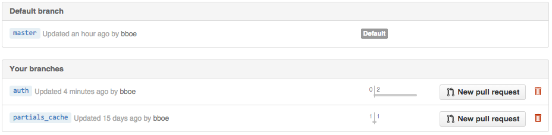

# Devise and GitHub Branch/PR Workflow
.fx: title

__CS290B__  
Bryce Boe  
October 22, 2014

https://github.com/scalableinternetservices/labslides/blob/master/devise.md

---
# Devise Setup

See: [https://github.com/plataformatec/devise](https://github.com/plataformatec/devise)

Create branch to add authentication (__Start Story Procedure__)

    !sh
    # Ensure on master and up-to-date (git checkout master, git pull)
    git checkout -b auth

Add to: __Gemfile__

    !ruby
    gem 'devise'

Execute:

    !sh
    bundle install
    rails generate devise:install
    # View/Edit config/initializers/devise.rb
    rails g devise user  # recall that 'g' is short for generate
    # Run the migration
    rake db:migrate
    # Commit this code
    git add .
    git commit -m "[#PTID] Generated devise scaffold user class."
    git push -u origin auth

---
# Devise Testing

Update: __test/fixtures/users.yml__

    !yaml
    one:
      email: one@test.com

    two:
      email: two@test.com

Execute:

     !sh
     RAILS_ENV=test rake db:migrate
     rake test
     # View Routes
     rake routes
     # Start server
     rails s

URLS:

* [http://localhost:3000/users/sign_in](http://localhost:3000/users/sign_in)
* [http://localhost:3000/users/sign_up](http://localhost:3000/users/sign_up)

---
# Adding a sign in / out link to all pages

Edit: __app/views/layouts/application.html.erb__ (add to end of _body_ tag, for
now)

    !erb
     <% if user_signed_in? %>
        <%= link_to 'Log Out', destroy_user_session_path,
                    method: :delete, data: { confirm: 'Are you sure?' } %>
     <% else %>
         <%= link_to 'Log In', new_user_session_path %> |
         <%= link_to 'Sign Up', new_user_registration_path %>
     <% end %>

Verify functionality

---
# Fix Controller Tests

Execute:

    !sh
    rake test

Observe errors:

> ActionView::Template::Error: undefined method `authenticate' for nil:NilClass

Edit: __test/test_helper.rb__

    !ruby
    class ActionController::TestCase
      include Devise::TestHelpers
    end

Execute:

    !sh
    rake test

---
# Commit and Make Pull Request

Execute (First part of __Finish Story Procedure__):

    !sh
    git status
    git diff
    git add .
    git commit -m "[Fix #PTID] Add basic authentication functionality."
    git push # This should _Finish_ the story in PivotalTracker

Create a pull request from your repo's branch list (the _Deliver_ on PT):

[https://github.com/scalableinternetservices/labapp/branches](https://github.com/scalableinternetservices/labapp/branches)

---
# Code Review, Test and Merge

(Final part of __Finish Story Procedure__)

* Requester should send a teammate the link the the PR on GitHub
* Teammate should make comments for any issues, or questions they have on the
  branch
* Teammate should checkout and _test_ the branch locally
* Requester should respond to any issues
* When all of teammate's comments have been addressed, teammate (not requester)
  should merge the PR, and then mark _Accept_ on the story in PT
* If the PR cannot automatically be merged, requester needs to _rebase_ from
  _master_ and fix any merge conflicts
  * May require an additional round of testing to ensure merge did not break
    any existing functionalty (you've been writing tests all along, right?)

---
# Enforce Authentication for Comments

__Goal__: Unauthenticated users are redirected to the login page when
attempting to create or edit a comment.

Follow the __Start Story Procedure__

Add to __CommentsController__: __app/controllers/comments_controller.rb__

    !ruby
    before_action :authenticate_user!, only: [:create, :edit, :new, :update]

__Note__: If you have Comment Controller tests, they will likely break due to
requiring authenicated users to perform the action. I will provide an example
to fix this later.

Follow the __Finish Story Procedure__

---
# Associate Comments with Users

__Goal__: Displayed comments should output the name of the user who created the
comment.

Follow the __Start Story Procedure__

Create and run the migration:

    rails g migration AddUserToComments user:references
    # Inspect the migration code, then apply
    rake db:migrate

## Remaining instructions will be added after class.
