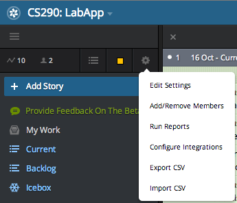
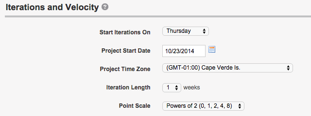

# Lab Three
.fx: title

__CS290B__  
Bryce Boe  
October 22, 2014

https://github.com/scalableinternetservices/labslides/blob/master/lab3.md

---
# Overview

* PivotalTracker
* What is a Sprint?
* What is a Story?
* Sprint Planning
* Initial GitHub Tasks

---
# PivotalTracker

[https://www.pivotaltracker.com/](https://www.pivotaltracker.com/)

> Simple, collaborative project management from the experts in agile software
development.

* __Everyone__: Create an account
* __One team member__:
    * Create a public project
    * Invite all other team members (as owners)
    * Invite bryce.boe@appfolio.com
    * Invite andrew.mutz@appfolio.com
* __Everyone else__: Accept invite

---
# Configure Settings (Location)

0. Click Hamburger button in upper left of window
0. Click on gear in upper right of drawer
0. Click "Edit Settings"

---
# Configure Settings (Options)

* __Start Iterations On__: Thursday
* __Project Start Date__: 10/23/2014
* __Project Time Zone__: (GMT-01:00) Cape Verde Is.
* __Point Scale__: Powers of 2

---
# PivotalTracker and GitHub Integration
.fx: img-left

With integration enabled, commit messages containing _[#PTStoryID]_ will
automatically add activity to a PT story.

## Examples

### Add Activity

    [#81211046] Generated Submission scaffold.

### _Finish_ a Story

    [Fix #81211046] Added validation to submissions.

### See also:

[PT Help:
SCM_POST_COMMIT](https://www.pivotaltracker.com/help/api?version=v3#scm_post_commit)

---
# What is a Sprint?

A sprint is a one week period of _work_ beginning each Wednesday at 6PM.

* __ALL__: Starts with _sprint planning_ (will occur during lab)
    * Create, describe, and estimate the _stories_ that need to be completed
    * Prioritize stories by importance
* __PAIR/INDIVIDUAL__: Work on and complete stories based on priority
  throughout the week
    * (Individually) Do not start more than one story at a time
    * (Suggested) Have another teammate _code review_ and test work before
      merging into master
* __ALL__: Ends with a _sprint review_ and _sprint retrospective_ (will occur during lab)
    * Report sprint's progress to Andrew and Bryce
    * Discuss issues, if any, from the sprint and make resolutions
    * Suggest and take action on methods for improving sprint productivity

---
# Sprint/Development Hints

* Additional sprint planning may be needed throughout a sprint. This involves
  the entire team.
* Code should be worked on in a branch and only merged into the master branch
  once it has been (1) code reviewed, and (2) tested by another teammate.
    * Code reviews can be done through GitHub's interface
    * Code review and teammate testing is less necessary when a story is
      completed through pairing
* Synchronize with _all_ teammates if you need to deviate from the plan.

---
# What is a story?

A story describes new or changed functionality to your web service from the
point of view of a user of your web service.

> As a [USER ROLE], I want [SOME GOAL] so that [SOME REASON].

## Examples

> As a logged in user, I want to have a list of all the comments I've made in
  order to quickly scan over my comment contributions.

> As an unauthenticated user, I should not be able to create a community.

[External
Reference](http://www.mountaingoatsoftware.com/blog/advantages-of-the-as-a-user-i-want-user-story-template)

---
# Stories on PivotalTracker

## Feature
* User-facing issues that represent new functionality or changes to the web
  application
* Often written as _user stories_, i.e., in terms of what the user wants to
  do/see/accomplish
* Estimate the amount of work required to complete

## Bug
* Categorizes unwanted functionality that affects (or may affect) users
* Describes steps needed to reproduce

## Chore
* Non-user facing changes that are not critical
* E.g., code refactoring, database clean-up

---
# Story Categorization

## Current
* Stories that are included in the current sprint (limited by velocity)
* Stories should be organized by priority, and _started_ in priority order
* Includes completed stories for the current sprint

## Backlog
* Location for stories that have been _groomed_, i.e., discussed with the
  group, described, and estimated
* Stories should only be started out the backlog in cases where _current_ has
  no remaining stories to complete
    * In this case, they should also be started in priority order

## Icebox

* Location to put stories that the team has not yet _groomed_
    * These stories may be groomed and incorporated into future sprints

---
# Initial PiviotalTracker Tasks

* Add a chore: "Create initial rails application"
* Add a chore: "Add README.md with team name, project description, and pivotal
  tracker link"
* __For each team member__:
    * Add a chore: "Add name and photo for team member in the README.md file."

---
# Sprint Planning

Spend approximately 30 minutes as a team to create and describe an initial set
of stories for your web application.

* Only one person should be at a computer entering the stories into PT
* Get a rough idea for what is needed first
* Detail exactly what is needed to _accept_ a story
* Estimate the _work_ required for each story
    * A 2-point estimation should require approximately twice as much effort as
      a 1-point story, and half as much effort as a 4-point story.
* Prioritize the stories, and add to PivotalTracker
    * Initially, only 10 points will be added to __current__, the remainder
      should be prioritized in the __backlog__

---
# Initial GitHub Tasks

* __One team member__:
    * Initialize your git repository with your rails application.
    * Remove `README.rst` and add our
      [README.md](https://raw.githubusercontent.com/scalableinternetservices/labapp/master/README.md)
        * Update the _project name_, _team name_, _project description_, and
          _pivotal tracker link_.
* __Everyone else__:
    * Clone the repository (once it has been added)
    * Add your name, GitHub link, and photo link to the README
        * __This is an exercise in conflict resolution__
    * (Optional) Add any other fun content to the README
