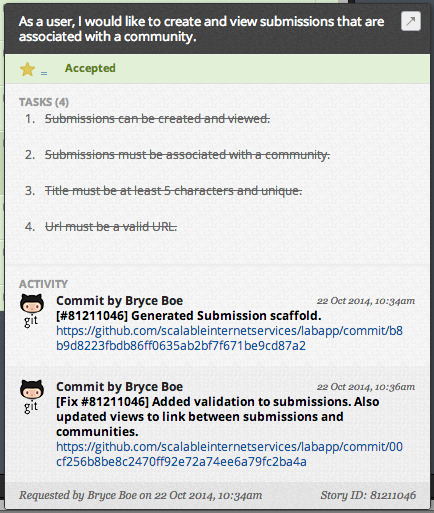

# Lab Three
.fx: title

__CS290B__  
Bryce Boe  
October 22, 2014

---
# Overview

* PivotalTracker
* What is a Sprint?
* What is a Story?

---
# PivotalTracker

[https://www.pivotaltracker.com/](https://www.pivotaltracker.com/)

> Simple, collaborative project management from the experts in agile software
development.

* __Everyone__: Create an account
* __One team member__:
    * Create a public project
    * Invite all other team members (as owners)
    * Invite bryce.boe@appfolio.com
    * Invite andrew.mutz@appfolio.com
* __Everyone else__: Accept invite

---
# Configure Settings (Location)

0. Click Hamburger button in upper left of window
0. Click on gear in upper right of drawer
0. Click "Edit Settings"

---
# Configure Settings (Options)

* __Start Iterations On__: Thursday
* __Project Start Date__: 10/23/2014
* __Project Time Zone__: (GMT-01:00) Cape Verde Is.
* __Point Scale__: Powers of 2

---
# PivotalTracker and Github Integration
.fx: img-left

With integration enabled, commit messages containing _[#PTStoryID]_ will
automatically add activity to a PT story.

## Examples

### Add Activity

    [#81211046] Generated Submission scaffold.

### "Finish" a Story

    [Fix #81211046] Added validation to submissions.

### See also:

[PT Help:
SCM_POST_COMMIT](https://www.pivotaltracker.com/help/api?version=v3#scm_post_commit)

---
# What is a Sprint?

A sprint is a one week period of "work" beginning each Wednesday at 6PM.

* __ALL__: Starts with _sprint planning_ (will occur during lab)
    * Create, describe, and estimate the _stories_ that need to be completed
    * Prioritize stories by importance
* __PAIR/INDIVIDUAL__: Work on and complete stories based on priority
  throughout the week
    * (Individually) Do not start more than one story at a time
    * (Suggested) Have another teammate _code review_ and test work before
      merging into master
* __ALL__: Ends with a _sprint review_ and _sprint retrospective_ (will occur during lab)
    * Report sprint's progress to Andrew and Bryce
    * Discuss issues, if any, from the sprint and make resolutions
    * Suggest and take action on methods for improving sprint productivity

---
# Sprint/Development Hints

* Additional sprint planning may be needed throughout a sprint. This involves
  the entire team.
* Code should be worked on in a branch and only merged into the master branch
  once it has been (1) code reviewed, and (2) tested by another teammate.
    * Code reviews can be done through the github interface
    * Code review and teammate testing is less necessary when a story is
      completed through pairing
* Synchronize with _all_ teammates if you need to deviate from the plan.

---
# First Steps

* __One team member__:
    * Initialize your git repository with your rails application.
    * Remove `README.rst` and add our
      [README.md](https://raw.githubusercontent.com/scalableinternetservices/labapp/master/README.md)
        * Update the _project name_, _team name_, _project description_, and
          _pivotal tracker link_.
* __Everyone else__:
    * Clone the repository (once it has been added)
    * Add your name, github link, and photo link to the README
        * __This is an exercise in conflict resolution__
    * (Optional) Add any other fun content to the README